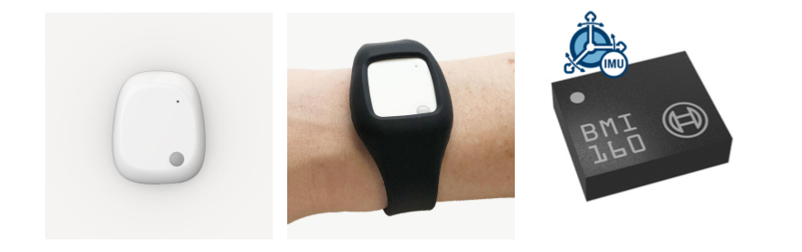

# AIoT Course - Human Gesture Recognition Project

**An End-to-end Artificial Intelligence of Things Project**

This is a repository that contains the demonstration of the Human Gesture 
Recognition of AIoT lectures which are part of the course "Algorithmic 
Foundations of Sensor Networks" in the Computer Engineering and Informatics 
Department, University of Patras.

If you are interested in the project, please send an email to
[tzamalis@ceid.upatras.gr](mailto:tzamalis@ceid.upatras.gr), with the subject 
“**AIoT Project 2025**”.

Υou should include the following information:
1. First Name
2. Last Name
3. email
4. GitHub account username
5. phone number

for **both** the members of the team, and **you will receive a response mail 
for the date and time when you can get the wearable device from the IoT Lab**:

* 1st floor, Building of Computer Engineering and Informatics Department, 
University of Patras.
* Pantelis Tzamalis: [https://tzamalisp.github.io/](https://tzamalisp.github.io/)
* George Kontogiannis: [https://github.com/gkontogiannhs](https://github.com/gkontogiannhs)

## About this Project

* A team of **2 students** is mandatory for each project
* Announcement date: **10 April, 2025, 23:00** 
* Delivery Date: **30 June, 2025, 23:59**
* Grade: **40%**
* You can submit that you are interested in this project until 
**16 May, 2025**.

## Project Description

In this project, you are prompted to create an end-to-end Artificial 
Intelligence of Things (AIoT) procedure in order to recognize a set of gestures 
automatically. This problem is identified as Human Gesture Recognition (HGR), 
which is actually the technology that uses sensors to read and interpret hand 
gestures as commands. Nowadays, HGR has multiple uses in various domains, such 
as healthcare, industry, gaming, etc. In the automotive industry, for instance, 
this capability allows drivers and passengers to interact with the vehicle — 
usually to control the infotainment system without touching any buttons or 
screens.

In particular, you will take advantage of the Mbientlab’s sensorial device, 
MetaMotionR research sensor kit [1], and its wristband [2], which is a 
wrist-worn device that provides recorded (logging) or real-time (streaming) 
sensor data. The sensor kit embeds the Bosch BMI160 Inertial Measurement Unit 
(IMU), which is a small, low power, low noise 16-bit inertial measurement unit 
designed for use in mobile applications like augmented reality or indoor 
navigation which require highly accurate, real-time sensor kinesiological 
data. In full operation mode, the user can enable both the accelerometer and 
gyroscope sensors to collect the movement data. The device, the wristband, and 
the embedded IMU are presented in Figure 1. 

For the data collection procedure, you can utilize the mobile and desktop 
open-source applications (MetaWear, MetaBase) that Mbientlab provides in the 
Apple Store (Mac, iPhone), the Play Store, and the Windows Store:

* [Mbientlab MetaWear and MetaBase Apps for iOS and macOS on App Store](https://apps.apple.com/us/developer/mbientlab-inc/id920878580)
* [Mbientlab MetaWear App on Play Store](https://play.google.com/store/apps/details?id=com.mbientlab.metawear.app)
* [Mbientlab MetaBase App on Play Store](https://play.google.com/store/apps/details?id=com.mbientlab.metawear.metabase)
* [Mbientlab MetaBase on Microsoft Store](https://apps.microsoft.com/store/detail/metabase/9NBLGGH4TXJ3)

As an alternative option, you can use the MetaWear APIs the company provides 
in Java, Swift, Javascript, Python, and C++ programming languages:

* [MetaWear APIs](https://mbientlab.com/tutorials/MetaWearAPI.html)

*Figure 1. From left to the right. a) the MetaMotionR research sensor kit, 
b) its wristband, and, c) the embedded Bosch BMI160 Inertial Measurement Unit 
(IMU).*

**For the learning scenario, you can select one of the activities’ classes to 
monitor, in the way they are presented in the publications:** 
1. A, D, M, L and U letters, as they are defined in publication [3].
2. Select a set of classes in Table 1 of publication [4].
3. Figure 2 of publication [5].

After collecting the data, you will proceed with data engineering and 
preparation methodologies in order to transform the data into a suitable 
format capable of training the AI models. Then, you will select between a set 
of supervised-learning models for the learning procedure (statistical or neural
networks), and finally you will evaluate the AI models with respect to their 
performance.

For the data engineering and preparation, it is suggested to follow some of 
the methodologies that are presented in:
1. [6], in sections II, III, and IV.
2. [3], in section 2.
3. [5], in sections B, C, D, E.
4. [7], in sections III, IV, and V.

However, it is suggested to read the whole papers in order to better 
understand the identification scenario. Finally, you will train the models 
with time-series series data (after the data engineering and preparation), 
defining a 1D problem solution.

**Note**: Jupyter Notebooks with coding hints will be provided with the 
project’s official announcement.

## Instructions for data collection

Based on your gestures collection definition, please, use accelerometer 
and/or gyroscope.

1. You familiarize with the wearable and select one or more of its sensors 
that indicate movement, i.e. accelerometer and/or gyroscope.
2. To properly collect the instances, you must be careful the data to contains 
exactly the instances of interest. This means that the recording of the data 
collection must start while you perform the gesture repetitively, and 
terminate the recording before you stop performing the gesture.
3. You use the wearable for X days and collect sensor data regarding the 
gesture scenario you want to monitor. 
4. You collect and annotate the data based on the gesture classes you want to 
train the AI model. 
5. Visualize the sensor data in the following ways: 
   1. Accelerometer data (3-axis)
   2. Gyroscope data (3-axis)
   3. Accelerometer and Gyroscope data (6-axis).

**Note: Collect a representative dataset, meaning each class should have 
almost the same time-length of instances in total.**

## Configuration

As the majority of software projects work with configuration files to set up 
the instantiation of their components or experiments, we follow the same 
principle in this project too.

Thus, a configuration file should contain all the parameters set up that are 
utilized for the project. To use this file, please, copy and rename the 
`config.yml.template` which is located in the root directory to `config.yml`.

The file should contain all parameters regarding the MongoDB host, the 
database name, the collection name, as well as parameters about the data 
engineering and the learning processes.

## Dataset creation

1. Follow the folder and files structure guideline which can be found 
in `data/README.md`.
2. Instantiate a `mongod` primary daemon process for the MongoDB system.
3. Based on the instructions in `01_dataset_creation.ipynb`:
   1. Create the database and the collection you will save your data.
   2. Transform the data in the proper MongoDB's document format.
   3. Upload the data to your collection.

Note: Use the MongoDB Compass GUI to check your databases and collections:

* https://www.mongodb.com/products/tools/compass

    
## Exploratory Data Analysis and Data Engineering

For the Exploratory Data Analysis (EDA) and the Data Engineering process for 
both a single instance, and the whole dataset, please, follow the instructions 
below. In particular, according to this step, your are prompted to implement 
and run the following steps:
1. Provide a barplot that contains the time-length of the collected instances 
for each class.
2. Split the data into fixed windows of X seconds with X% overlap (in samples). 
3. Provide a barplot with the count of instances that occurred after this 
process, for each class.
4. Filter the data with a low-pass filter at a frequency of X Hz. 
5. Transform the data into the frequency domain (in the case only of 
addressing the problem as 2D)
6. Visualize a time-series instance of the transformed dataset to see the 
effect of the filter to the signal.

## Data Preparation

1. Split the data into train and test sets (in the case of Neural Networks 
usage, split the data into train/validation/test sets). 
2. Use a scaling algorithm to scale the data into a standard value range 
(Standardization, Min Max Normalization).
3. Perform dimensionality reduction (if needed) by using Principal Component 
Analysis (PCA).
4. The data is in proper format to feed the ML model.

## Learning Process (ML Modeling)

1. Select a supervised Machine Learning approach to perform the gesture 
recognition scenario. For instance, you can use an ML model from the 
statistical Support Vector Machines (SVM) or a Neural Network architecture 
(Convolutional Neural Networks are suggested)
   * If you use a Neural Network, you can use the TensorFlow API.
   * If you use a Neural Network, you should plot the `architecture` of the 
   TensorFlow model (e.g., CNNs, RNNs, etc.). 
   * If you use a Neural Network, print the `summary` of the TensorFlow model.
   * If you use a Neural Network, evaluate the Neural Network training 
   procedure and its performance on the test set by plotting the Learning 
   curves during the training procedure: Accuracy, Loss.
   * If you use a statistical ML model, you can use the scikit-learn library.
2. Fit the data into the model. 
3. Evaluate the ML model performance in the form of Confusion Matrix and 
Classification Report by using the evaluation metrics that arise from the 
True Positives, False Positives, True Negatives, False Negatives 
classification results. 
4. Fine-tune the ML model (e.g., use Exhaustive Grid Search 
algorithm).
5. **Interpret the results!!**: You should include the main information in the 
Notebook and at a more abstract level in the report document (`.docx` file - 
see the instructions below).

## Report

**You will provide us with a downloadable Google Drive or One Drive link to 
the email `tzamalis@ceid.upatras.gr` that will contain**:

* the **code** of the project
* the collected **dataset** with its annotated metadata, 
* a **1 page report** related to the data collection procedure, the classes, 
how the data was annotated, the controlled environment, how you trained the
AI model, interpreting also the results of the evaluation process.

Some additional useful information about the report are provided below.

Code Information:
* The code used to convert the CSV data into a format (data engineering, data 
preparation), capable of training the models.
* The code used to train and evaluate the models. 
* The code could be in a notebook or in scripting format, however, a 
`README.md` of how to automatically run the data loading, data processing, 
model training, and model evaluation process as one should be delivered. 
* The `README.md` file should contain the instructions of how to run the code
* The `README.md` should describe clearly how you performed the gestures' 
collection procedure (maybe a Figure too).
* The code should be well documented and commented.

Documentation:
* A short documentation, max 1 page, in `.docx` format, describing the process 
that you took to convert the data and generate the model. Include your 
observations on the accuracy of the model regarding the classes’ identification. 
* If the `.docx` file is not possible, you can use a `PDF` file.
* The documentation should be in English and should be written in a 
professional manner.
* The documentation should be in a single file, not in multiple files.
* If the `.docx` file is more than 1 page, you will lose points.

## Technologies

The following list provides all the necessary Python packages that can be 
exploited for the project needs:

* Data Engineering: NumPy, SciPy, pandas 
* Data preparation: scikit-learn
* Visualization: Matplotlib, seaborn, pandas
* AI modeling: scikit-learn, TensorFlow 

However, the whole Python environment setup can be found in the 
`requirements.txt` file in the root directory.

If you need some extra knowledge of how to utilize Pandas, NumPy, MatplotLib, 
seaborn, scikit-learn, and other Data Science stuff, you can read and 
experiment with the tutorials that can be found here:

* [Python Data Science and Machine Learning Tutorials](https://github.com/tzamalisp/data-science-and-machine-learning-tutorials)

## Important Notes (READ THIS CAREFULLY)

* You can write your own functions in the `utils.py` or `utils_visual.py` 
or modify the existing ones, however, you should **NOT** modify the 
rest of the files and folders. 
* If any changes take place in these two files, keep in mind to write down the 
proper documentation, as well as the docstrings in the same Python Style 
Format (Google) that is included in the project announcement.
* * The main project's code should run **ONLY** in the Jupyter Notebook.
* You can select and deploy any of the ML models that are presented 
in the literature section.
* The project should be implemented in Python 3.8 or higher.
* **Modify** the `requrements.txt` file to contain the latest versions of the 
libraries you use and disable compatibility issues between them.

## References

[1] "MMR – MetaMotionR," Mbientlab, [Online]. Available: https://mbientlab.com/store/metamotionr/.

[2] Mbientlab, "Wrist Band Kit for MMC and MMR," Mbientlab, [Online]. Available: https://mbientlab.com/store/wristband-sensor-research-kit/.

[3] Iyer, Darshan, Fahim Mohammad, Yuan Guo, Ebrahim Al Safadi, Benjamin J. Smiley, Zhiqiang Liang, and Nilesh K. 
Jain., "Generalized hand gesture recognition for wearable devices in IoT: Application and implementation challenges.," 
in Machine Learning and Data Mining in Pattern Recognition: 12th International Conference, MLDM 2016, New York, NY, 
USA, 2016. 

[4] Xu, Chao, Parth H. Pathak, and Prasant Mohapatra., "Finger-writing with smartwatch: A case for finger and hand 
gesture recognition using smartwatch," in 16th International Workshop on Mobile Computing Systems and Applications, 2015. 

[5] Liu, Fang-Ting, Yong-Ting Wang, and Hsi-Pin Ma., "Gesture recognition with wearable 9-axis sensors.," in 
International Conference on Communications (ICC), 2017. 

[6] Tzamalis, Pantelis, Andreas Bardoutsos, Dimitris Markantonatos, Christoforos Raptopoulos, Sotiris Nikoletseas, 
Xenophon Aggelides, and Nikos Papadopoulos., "End-to-end Gesture Recognition Framework for the Identification of 
Allergic Rhinitis Symptoms.," in 2022 18th International Conference on Distributed Computing in Sensor Systems (DCOSS), 
Marina del Rey, Los Angeles, CA, USA, 2022. 

[7] Zhu, Peide, Hao Zhou, Shumin Cao, Panlong Yang, and Shuangshuang Xue., "Control with gestures: A hand gesture 
recognition system using off-the-shelf smartwatch.," in IEEE, 4th International Conference on Big Data Computing and 
Communications (BIGCOM), 2018. 

[8] Tzamalis, Pantelis, "Python Data Science and Machine Learning Tutorials", [Online]. Available: https://github.com/tzamalisp/data-science-and-machine-learning-tutorials

## Contact

Dr. Pantelis Tzamalis, *Engineering Manager*
* email: [tzamalis@ceid.upatras.gr](mailto:tzamalis@ceid.upatras.gr)
* GitHub: [https://github.com/tzamalisp](https://github.com/tzamalisp)
* Website: [https://tzamalisp.github.io)](https://tzamalisp.github.io)
* Social: [https://www.linkedin.com/in/pantelis-tzamalis/](https://www.linkedin.com/in/pantelis-tzamalis/)

George Kontogiannis, *Ph.D. Candidate*
* email: [george.k.kontogiannis@gmail.com](mailto:george.k.kontogiannis@gmail.com)
* GitHub: [https://github.com/gkontogiannhs](https://github.com/gkontogiannhs)
* Social: [https://www.linkedin.com/in/george-kontogiannis/](https://www.linkedin.com/in/george-kontogiannis/)
